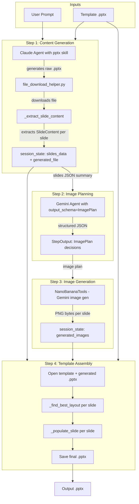
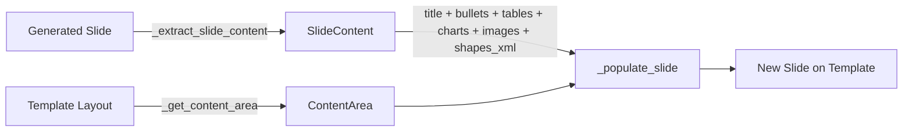

# Architecture: PowerPoint Template Workflow

**File:** `cookbook/90_models/anthropic/skills/powerpoint_template_workflow.py`
**Date:** 2026-02-19
**Pattern:** Sequential Agno Workflow with mixed agent steps and executor functions

---

## Overview

This cookbook implements a **4-step Agno Workflow pipeline** that generates professional PowerPoint presentations by combining AI content generation, AI image creation, and deterministic template assembly. The pipeline takes a user prompt and a `.pptx` template file, producing a final presentation that matches the template's visual style.

The architecture separates concerns into distinct workflow steps:
1. An LLM generates raw slide content
2. A second LLM plans which slides need images
3. An image generation model creates visuals
4. A deterministic function assembles everything onto the template

---

## Workflow Data Flow



---

## Dependencies

| Package | Purpose |
|---------|---------|
| `agno` | Agent, Workflow, Step, Claude model, Gemini model, NanoBananaTools |
| `anthropic` | Anthropic API client for downloading skill-generated files |
| `python-pptx` | Presentation reading/writing, shapes, charts, placeholders |
| `lxml` | XML manipulation for removing template slides and shape ID management |
| `pydantic` | Structured output schemas for image planning |
| `pillow` | Required by NanoBananaTools for image handling |

**Local dependency:**
- [`file_download_helper.py`](file_download_helper.py) — Downloads files produced by Claude's `pptx` skill via the Anthropic Files API. Detects file type from magic bytes and saves to disk.

---

## Data Models

### Pydantic Models — Structured Agent Output

| Model | Purpose | Used In |
|-------|---------|---------|
| [`SlideImageDecision`](powerpoint_template_workflow.py:53) | Per-slide decision: needs image? prompt? reasoning? | Step 2 output |
| [`ImagePlan`](powerpoint_template_workflow.py:72) | List of `SlideImageDecision` for all slides | Step 2 `output_schema` |

### Dataclasses — Internal Content Representation

| Dataclass | Purpose | Fields |
|-----------|---------|--------|
| [`TableData`](powerpoint_template_workflow.py:86) | Extracted table with position | `rows`, `left`, `top`, `width`, `height` |
| [`ImageData`](powerpoint_template_workflow.py:97) | Extracted image blob with position | `blob`, `left`, `top`, `width`, `height`, `content_type` |
| [`ChartExtract`](powerpoint_template_workflow.py:109) | Extracted chart data with position | `chart_type`, `categories`, `series`, `left`, `top`, `width`, `height` |
| [`SlideContent`](powerpoint_template_workflow.py:122) | All content from one slide | `title`, `subtitle`, `body_paragraphs`, `tables`, `images`, `charts`, `shapes_xml` |
| [`ContentArea`](powerpoint_template_workflow.py:134) | Safe content region on a template slide in EMU | `left`, `top`, `width`, `height` |

**Data flow through the pipeline:**



---

## Step-by-Step Architecture

### Step 1: Content Generation

**Type:** Executor function
**Function:** [`step_generate_content()`](powerpoint_template_workflow.py:656)
**Agent:** Claude `claude-sonnet-4-5-20250929` with `pptx` skill

**Flow:**
1. Reads the template to extract available layout names
2. Builds an enhanced prompt with structural requirements for template compatibility
3. Creates a Claude `Agent` with the `pptx` skill and formatting instructions
4. Runs the agent, which generates a `.pptx` file server-side
5. Downloads the generated file via [`download_skill_files()`](file_download_helper.py:34) using the Anthropic Files API
6. Validates the download is a valid `.pptx` file
7. Opens the generated presentation and extracts [`SlideContent`](powerpoint_template_workflow.py:122) from each slide using [`_extract_slide_content()`](powerpoint_template_workflow.py:149)
8. Stores extracted data in `session_state` for downstream steps:
   - `generated_file`: path to the downloaded `.pptx`
   - `slides_data`: list of slide metadata dicts
   - `total_slides`: count

**Agent instructions** enforce:
- One clear title per slide
- 4-6 concise bullet points
- Tables limited to 6 rows x 5 columns
- No custom fonts, colors, SmartArt, or animations
- Standard slide ordering: Title, Content, Closing

### Step 2: Image Planning

**Type:** Agent step
**Agent:** [`image_planner`](powerpoint_template_workflow.py:815) — Gemini `gemini-2.5-flash-image` with `output_schema=ImagePlan`

**Flow:**
1. Receives the JSON summary of slides from Step 1 as input
2. Uses Gemini with structured output to decide per-slide whether an image is needed
3. Outputs an [`ImagePlan`](powerpoint_template_workflow.py:72) with a list of [`SlideImageDecision`](powerpoint_template_workflow.py:53)s

**Decision guidelines** encoded in agent instructions:
- Title slides: usually YES
- Data slides with tables/charts: usually NO
- Slides with existing images: ALWAYS NO
- Closing slides: usually NO

### Step 3: Image Generation

**Type:** Executor function
**Function:** [`step_generate_images()`](powerpoint_template_workflow.py:847)
**Tool:** `NanoBananaTools` with `aspect_ratio="16:9"`

**Flow:**
1. Parses the `ImagePlan` from Step 2
2. Filters out slides that already have images from Claude
3. For each slide needing an image, calls `nano_banana.create_image()` with the prompt
4. Stores generated PNG bytes in `session_state["generated_images"]` keyed by slide index

**Resilience:** Gracefully handles missing `GOOGLE_API_KEY`, unparseable plans, and individual image generation failures without stopping the workflow.

### Step 4: Template Assembly

**Type:** Executor function
**Function:** [`step_assemble_template()`](powerpoint_template_workflow.py:958)

**Flow:**
1. Copies the template file to the output path
2. Opens the copy as the output presentation
3. Removes all existing slides from the template copy using `lxml` XML manipulation
4. For each generated slide:
   a. Extracts content via [`_extract_slide_content()`](powerpoint_template_workflow.py:149)
   b. Appends any AI-generated image from `session_state` as an [`ImageData`](powerpoint_template_workflow.py:97)
   c. Selects the best template layout via [`_find_best_layout()`](powerpoint_template_workflow.py:281)
   d. Creates a new slide from the selected layout
   e. Populates the slide via [`_populate_slide()`](powerpoint_template_workflow.py:571)
5. Saves the final presentation

---

## Content Extraction and Assembly Functions

### Extraction

| Function | Line | Purpose |
|----------|------|---------|
| [`_extract_slide_content()`](powerpoint_template_workflow.py:149) | 149 | Walks all shapes on a slide. Classifies each as table, chart, picture, group, or text. Extracts placeholder text by `idx` — 0=title, 1=subtitle/body, >1=other body. Non-placeholder shapes are captured as raw XML. |

**Shape processing order:**
1. Tables → `TableData`
2. Charts → `ChartExtract`
3. Pictures → `ImageData`
4. Groups → XML clone + recursive image extraction
5. Text frames → title/subtitle/body classification
6. Other shapes → XML clone

### Template Layout Selection

| Function | Line | Purpose |
|----------|------|---------|
| [`_find_best_layout()`](powerpoint_template_workflow.py:281) | 281 | Heuristic matching of slide position to template layout. Title slide → layout with name containing *title slide*. Last slide → *blank/closing/end*. Content slides → *content/body/text*, then *object/list*, then second layout. |

### Content Area Detection

| Function | Line | Purpose |
|----------|------|---------|
| [`_get_content_area()`](powerpoint_template_workflow.py:320) | 320 | Derives the safe content region from a template layout's placeholders. Strategy: body placeholder idx=1 first, then any non-title placeholder, then default safe margins at 5%/25%/90%/65% of slide dimensions. All values in EMU. |

### Visual Quality Functions

| Function | Line | Purpose |
|----------|------|---------|
| [`_fit_to_area()`](powerpoint_template_workflow.py:359) | 359 | Aspect-ratio-preserving scaling. Fits an image within a `ContentArea` and centers it. Returns `left, top, width, height` tuple in EMU. |
| [`_populate_placeholder_with_format()`](powerpoint_template_workflow.py:389) | 389 | Preserves template paragraph/run XML formatting. Captures `pPr` and `rPr` elements from the first template paragraph, clears the text frame, inserts new text with cloned formatting. Enables `word_wrap` and calls `fit_text()` for auto-sizing with fallback to `MSO_AUTO_SIZE.TEXT_TO_FIT_SHAPE`. |

### Transfer Functions

All transfer functions receive a [`ContentArea`](powerpoint_template_workflow.py:134) to position content within the template's safe region.

| Function | Line | Purpose |
|----------|------|---------|
| [`_transfer_tables()`](powerpoint_template_workflow.py:455) | 455 | Creates tables within the content area. Multiple tables stack vertically. Header row uses `Pt(11)`, data cells `Pt(10)`. Word wrap enabled on all cells. |
| [`_transfer_images()`](powerpoint_template_workflow.py:500) | 500 | Adds images scaled and centered within the content area via `_fit_to_area()`. |
| [`_transfer_charts()`](powerpoint_template_workflow.py:508) | 508 | Recreates charts from `CategoryChartData` within the content area. Multiple charts stack vertically. Handles None and non-numeric values. |
| [`_transfer_shapes()`](powerpoint_template_workflow.py:555) | 555 | Deep-copies raw shape XML to the target slide's `spTree`. Reassigns element IDs to avoid collisions. |

### Slide Assembly Orchestrator

| Function | Line | Purpose |
|----------|------|---------|
| [`_populate_slide()`](powerpoint_template_workflow.py:571) | 571 | Orchestrates all transfers for a single slide. Computes `ContentArea` from the layout. Fills title placeholder idx=0, body placeholder idx=1, then fallback textboxes if placeholders are missing. Calls all transfer functions. |

**Placeholder filling priority:**
1. Placeholder idx=0 → title text
2. Placeholder idx=1 → body paragraphs or subtitle
3. Placeholder idx>1 → body paragraphs overflow
4. Fallback textbox at content area position → title or body

---

## Session State Schema

The `session_state` dict is shared across all workflow steps:

```python
session_state = {
    # Set at workflow creation from CLI args
    "template_path": str,       # Path to the .pptx template file
    "output_dir": str,          # Directory for intermediate files
    "output_path": str,         # Final output .pptx path

    # Set by Step 1
    "generated_file": str,      # Path to Claude-generated .pptx
    "slides_data": list,        # List of slide metadata dicts
    "total_slides": int,        # Number of slides

    # Set by Step 3
    "generated_images": dict,   # {slide_index: PNG bytes}
}
```

---

## CLI Interface

**Function:** [`parse_args()`](powerpoint_template_workflow.py:1077)

| Flag | Short | Required | Default | Description |
|------|-------|----------|---------|-------------|
| `--template` | `-t` | Yes | — | Path to `.pptx` template file |
| `--output` | `-o` | No | `presentation_from_template.pptx` | Output filename |
| `--prompt` | `-p` | No | Built-in 6-slide demo | Custom presentation prompt |
| `--no-images` | — | No | `False` | Skip Steps 2 and 3 entirely |

**Usage examples:**

```bash
# Basic usage with template
.venvs/demo/bin/python cookbook/90_models/anthropic/skills/powerpoint_template_workflow.py \
    --template my_template.pptx

# Custom prompt and output
.venvs/demo/bin/python cookbook/90_models/anthropic/skills/powerpoint_template_workflow.py \
    -t my_template.pptx -o report.pptx -p "Create a 5-slide AI trends presentation"

# Skip image generation
.venvs/demo/bin/python cookbook/90_models/anthropic/skills/powerpoint_template_workflow.py \
    -t my_template.pptx --no-images
```

---

## Workflow Construction

The workflow is conditionally assembled based on CLI flags:


*Dashed steps are skipped when `--no-images` is used.*

| Step | Name | Type | Executor/Agent |
|------|------|------|----------------|
| 1 | Content Generation | `executor` | `step_generate_content` |
| 2 | Image Planning | `agent` | `image_planner` - Gemini with `output_schema` |
| 3 | Image Generation | `executor` | `step_generate_images` |
| 4 | Template Assembly | `executor` | `step_assemble_template` |

**Agno Workflow wiring** at [`line 1187`](powerpoint_template_workflow.py:1187):
- Each `Step` can have either an `agent` or an `executor` — not both
- Agent steps pass `step_input.previous_step_content` as the prompt
- Executor steps receive `(step_input, session_state)` and return `StepOutput`
- `session_state` is shared across all steps for passing large data like file paths and image bytes

---

## Environment Variables

| Variable | Required | Purpose |
|----------|----------|---------|
| `ANTHROPIC_API_KEY` | Yes | Claude agent and Anthropic Files API |
| `GOOGLE_API_KEY` | For images | Gemini image planner and NanoBananaTools image generation |

---

## Key Design Decisions

### Why Workflow over Team?

The pipeline is **strictly sequential** — each step depends on the previous step's output. A Workflow with ordered Steps is the natural fit. A Team-based approach would add coordination overhead without benefit since there is no parallelism or dynamic delegation.

### Why Mixed Agent + Executor Steps?

- **Steps 1 and 2** involve LLM reasoning and benefit from Agno Agent abstractions
- **Steps 3 and 4** are primarily procedural: calling an API in a loop and manipulating python-pptx objects. Executor functions give full control over error handling and session state management.

### Why Deterministic Template Assembly?

The template assembly step is entirely deterministic — no LLM is involved. This is intentional because:
- LLMs generating python-pptx code introduce non-determinism
- Visual quality rules like `fit_text()`, content area positioning, and font sizing must always be applied
- Deterministic assembly is testable and predictable

### Why ContentArea-Based Positioning?

Content extracted from Claude's generated slides has EMU positions specific to Claude's default slide dimensions. Transferring these raw values to a different template causes misalignment, overflow, and clipping. The `ContentArea` abstraction normalizes positioning by deriving safe bounds from the template's own placeholders. See [`DESIGN_visual_quality.md`](DESIGN_visual_quality.md) for the full design rationale.

---

## File Organization

```
cookbook/90_models/anthropic/skills/
    powerpoint_template_workflow.py    # This file — the 4-step workflow
    agent_with_powerpoint_template.py  # Simpler single-agent version
    file_download_helper.py            # Shared: downloads skill-generated files
    my_template.pptx                   # Sample template
    my_template1.pptx                  # Alternate sample template
    DESIGN_visual_quality.md           # Design doc for visual quality fixes
    ARCHITECTURE_powerpoint_template_workflow.md  # This architecture doc
    README.md                          # Cookbook README
    TEST_LOG.md                        # Test results log
```

---

## Related Documents

- [`DESIGN_visual_quality.md`](DESIGN_visual_quality.md) — Detailed design for the `ContentArea`-based visual quality improvements and Phase 2 Team-based refactor proposal
- [`agent_with_powerpoint_template.py`](agent_with_powerpoint_template.py) — Simpler single-agent variant that shares the same extraction and assembly functions
